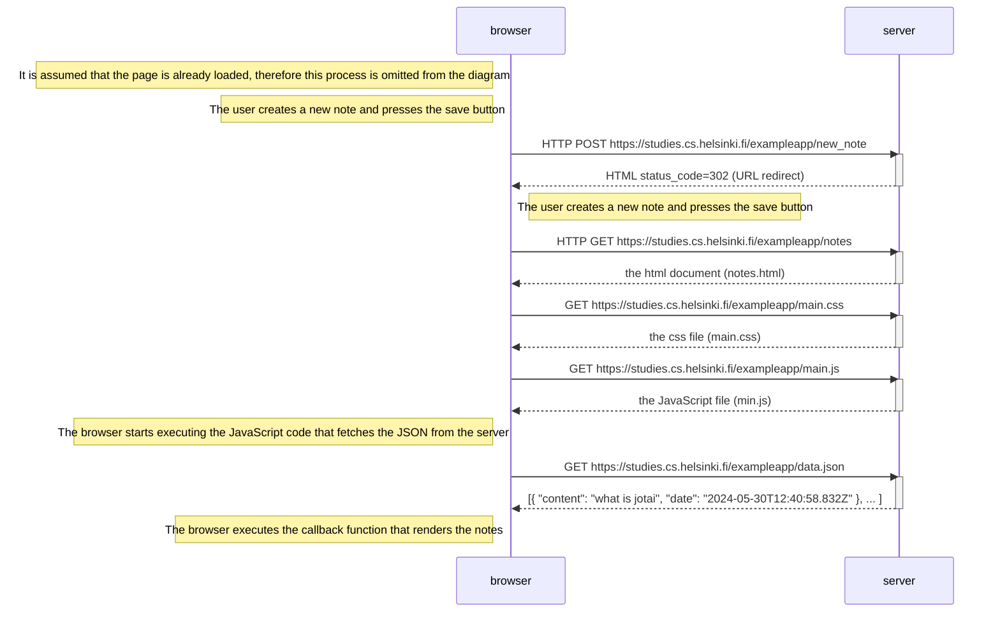

```mermaid
sequenceDiagram
    participant browser
    participant server

    Note left of browser: It is assumed that the page is already loaded, therefore this process is omitted from the diagram
    Note left of browser: The user creates a new note and presses the save button

    browser->>server: HTTP POST https://studies.cs.helsinki.fi/exampleapp/new_note
    activate server
    server-->>browser: HTML status_code=302 (URL redirect)
    deactivate server

    Note right of browser: The user creates a new note and presses the save button

    browser->>server: HTTP GET https://studies.cs.helsinki.fi/exampleapp/notes
    activate server
    server-->>browser: the html document (notes.html)
    deactivate server

    browser->>server: GET https://studies.cs.helsinki.fi/exampleapp/main.css
    activate server
    server-->>browser: the css file (main.css)
    deactivate server

    browser->>server: GET https://studies.cs.helsinki.fi/exampleapp/main.js
    activate server
    server-->>browser: the JavaScript file (min.js)
    deactivate server

    Note left of browser: The browser starts executing the JavaScript code that fetches the JSON from the server

    browser->>server: GET https://studies.cs.helsinki.fi/exampleapp/data.json
    activate server
    server-->>browser: [{ "content": "what is jotai", "date": "2024-05-30T12:40:58.832Z" }, ... ]
    deactivate server

    Note left of browser: The browser executes the callback function that renders the notes
```