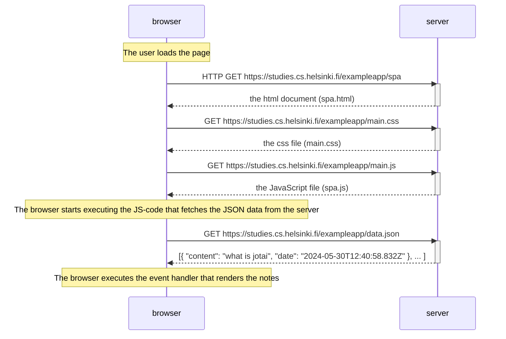

```mermaid
sequenceDiagram
    participant browser
    participant server

    Note over browser: The user loads the page

    browser->>server: HTTP GET https://studies.cs.helsinki.fi/exampleapp/spa
    activate server
    server-->>browser: the html document (spa.html)
    deactivate server

    browser->>server: GET https://studies.cs.helsinki.fi/exampleapp/main.css
    activate server
    server-->>browser: the css file (main.css)
    deactivate server

    browser->>server: GET https://studies.cs.helsinki.fi/exampleapp/main.js
    activate server
    server-->>browser: the JavaScript file (spa.js)
    deactivate server

    Note over browser: The browser starts executing the JS-code that fetches the JSON data from the server

    browser->>server: GET https://studies.cs.helsinki.fi/exampleapp/data.json
    activate server
    server-->>browser: [{ "content": "what is jotai", "date": "2024-05-30T12:40:58.832Z" }, ... ]
    deactivate server

    Note over browser: The browser executes the event handler that renders the notes
```