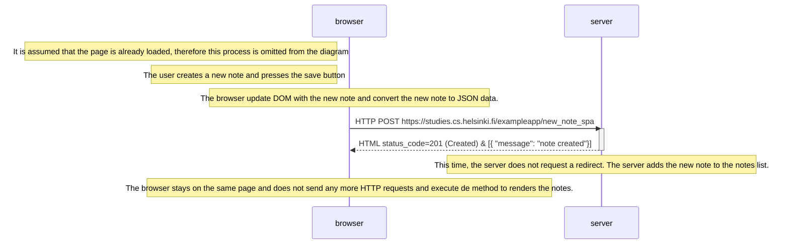

```mermaid
sequenceDiagram
    participant browser
    participant server

    Note left of browser: It is assumed that the page is already loaded, therefore this process is omitted from the diagram
    Note left of browser: The user creates a new note and presses the save button
    Note over browser: The browser update DOM with the new note and convert the new note to JSON data.

    browser->>server: HTTP POST https://studies.cs.helsinki.fi/exampleapp/new_note_spa
    activate server
    server-->>browser: HTML status_code=201 (Created) & [{ "message": "note created"}]
    deactivate server

    Note over server: This time, the server does not request a redirect. The server adds the new note to the notes list.

    Note over browser: The browser stays on the same page and does not send any more HTTP requests and execute de method to renders the notes.

```